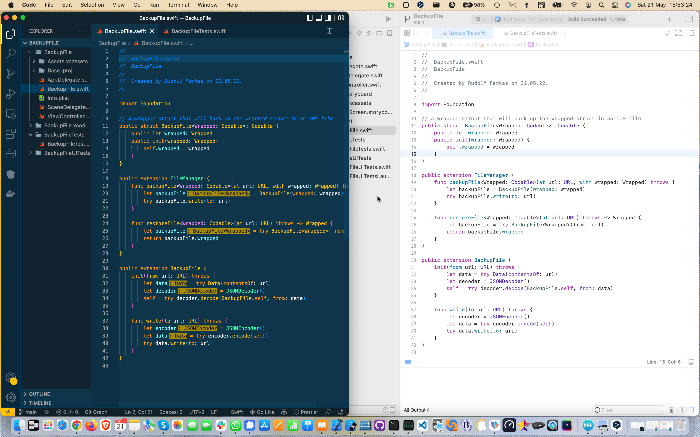
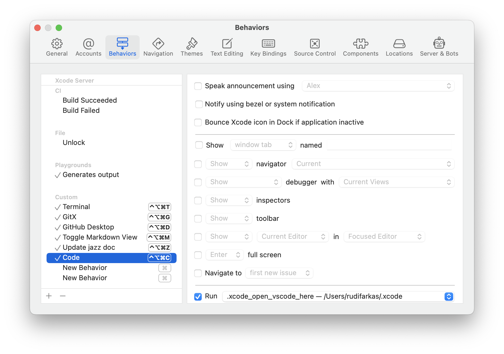

# Github Copilot for Swift iOS Developers

So you signed up and joined the [Github Copilot](https://copilot.github.com/) waiting list, waited..., received the invitation, installed the Copilot extension in your VSCode, and started with co-programming.

You co-wrote scripts in javascript, Python, [your favorite language], and even in Swift.

Amazed? Frustrated? Getting the hang of it? Starting to enjoy the experience?

Probably all of the above.

But how about those iOS projects that you're working on, in Xcode? Could the iOS and macOS projects benefit from the Copilot?

Currently the Copilot is available for Visual Studio Code, Visual Studio, Neovim, and JetBrains. No traces of Xcode there, and no macrumors that I know of about an Xcode Copilot integration.

## But wait, let's try something simple

- open an iOS project in Xcode

- open the VS Code at the Xcode project's root folder

- arrange both windows side by side

- open the same Swift file in both VS Code and Xcode

- in VS Code type some new Swift code or just comments expressing your intent

- see what the Copilot proposes and accept if it looks good or promising

- save the file in VS Code; Xcode will pick up the changes soon enough

- build and run the project in Xcode

- ... and it works! (well, not every time, it may need some nudges, retries or corrections).

## Here is an example

I opened a new Xcode project and a new file, `BackupFile.swift`, and just inserted the comment

```
// a wrapper struct that will back up the wrapped struct in an iOS file
```

The Copilot generated the code shown here:



```

// a wrapper struct that will back up the wrapped struct in an iOS file
public struct BackupFile<Wrapped: Codable>: Codable {
    public let wrapped: Wrapped
    public init(wrapped: Wrapped) {
        self.wrapped = wrapped
    }
}

public extension FileManager {
    func backupFile<Wrapped: Codable>(at url: URL, with wrapped: Wrapped) throws {
        let backupFile = BackupFile(wrapped: wrapped)
        try backupFile.write(to: url)
    }

    func restoreFile<Wrapped: Codable>(at url: URL) throws -> Wrapped {
        let backupFile = try BackupFile<Wrapped>(from: url)
        return backupFile.wrapped
    }
}

public extension BackupFile {
    init(from url: URL) throws {
        let data = try Data(contentsOf: url)
        let decoder = JSONDecoder()
        self = try decoder.decode(BackupFile.self, from: data)
    }

    func write(to url: URL) throws {
        let encoder = JSONEncoder()
        let data = try encoder.encode(self)
        try data.write(to: url)
    }
}

```

Actually, the Copilot proposed several variants of code which I could see by typing `ctrl-enter`. The variant which I chose looked plausible, and was short and to the point.

Next I openeed the file `BackupFileTests.swift` and inserted the comment

```
// a sample struct for use in testing the BackupFile wrapper
```

into the function `test_BackupFile`. From this comment the Copilot generated not only a sample struct but also the test code:

```
    func test_BackupFile() throws {
        // a sample struct for use in testng the BackupFile wrapper
        struct Sample: Codable {
            let name: String
            let age: Int
        }

        let sample = Sample(name: "Rudolf", age: 42)

        let backupFile = BackupFile(wrapped: sample)
        let encoder = JSONEncoder()
        let data = try encoder.encode(backupFile)
        let decoder = JSONDecoder()
        let restoredBackupFile = try decoder.decode(BackupFile<Sample>.self, from: data)
        XCTAssertEqual(restoredBackupFile.wrapped.name, sample.name)
        XCTAssertEqual(restoredBackupFile.wrapped.age, sample.age)
    }

```

The generated test passed:

```
...
Test Case '-[BackupFileTests.BackupFileTests test_BackupFile]' started.
Test Case '-[BackupFileTests.BackupFileTests test_BackupFile]' passed (0.012 seconds).
...

```

As an aside, the Copilot made a poor guess of my age, which is exactly the double of that in the `sample`.

## Conclusions

Github Copilot is an excellent addition to a programmer's toolbag.

It does not do all the work for you, and often it needs nudging to go in the right direction. On the other hand, it picks up rapidly your stylistic preferences, after you typed some example code. It excells in generating variants, for example in writing unit tests. And it can save much of the time that you would spend to look up minute details of the APIs and frameworks that you need for the task at hand.

## Hints and tricks

##### Install [Rectangle](https://rectangleapp.com/)

- helps to arrange the VS Code and Xcode windows side by side.

##### Add a [shortcut](https://karthikmk.medium.com/xcode-custom-behaviours-99e1743321d4) to Xcode to open VS Code in the Xcode project folder:

- create a script named `~/.xcode/.xcode_open_vscode_here` containing:

```
#! /bin/bash
/usr/local/bin/code `pwd`
```

- in `Xcode > Behaviors > Edit Behaviors... > Custom` link the script to a keybord shortcut, for example `ctrl-shift-cmd-C`



## Feedback

[@rudifa](https://twitter.com/rudifa?lang=en)

[github-copilot](https://github.com/rudifa/github-copilot) [@rudifa](https://github.com/rudifa)

